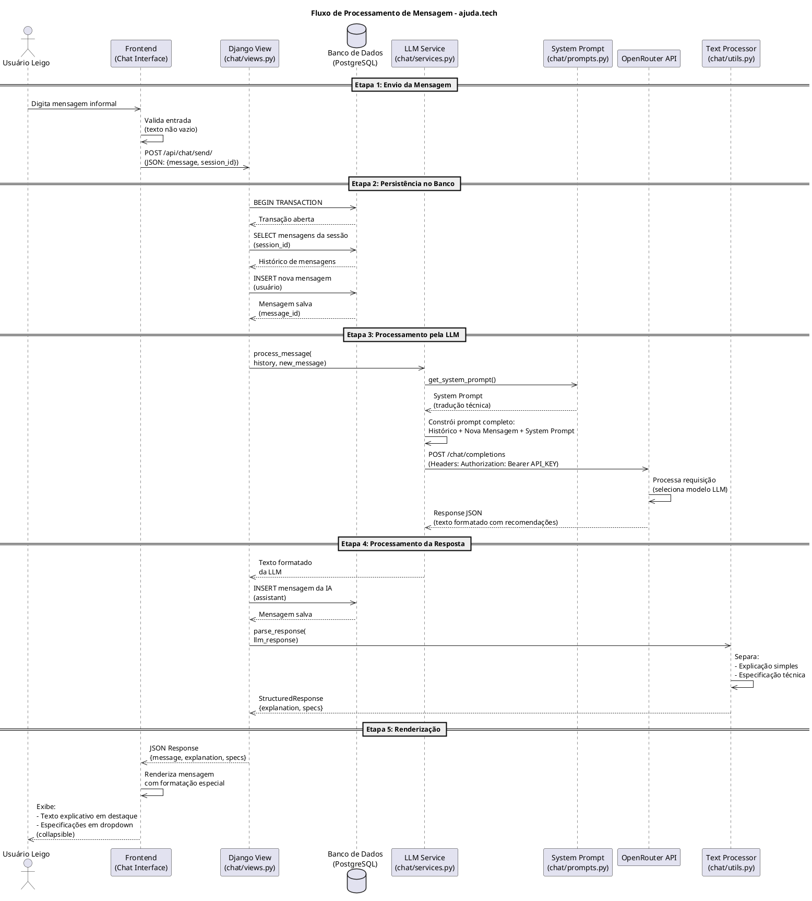

# Prompt
Atue como um Engenheiro de Software Sênior e Projetista de Sistemas.

Contexto do Projeto:

"ajuda.tech" - Fluxo de processamento de mensagem de um usuário leigo. É fundamental modelar o ciclo de vida da requisição para entender como o texto informal vira uma consulta à LLM e retorna como uma recomendação estruturada que o Django vai renderizar de forma amigável na tela.

Tarefa:

Gere o código de um Diagrama de Sequência utilizando a sintaxe PlantUML.

O fluxo deve mapear a seguinte sequência:

1. O Usuário Leigo digita uma mensagem simples na interface de chat (Frontend).

2. O Frontend envia via requisição (POST/AJAX) para a View do Django.

3. O Django intercepta a mensagem, abre uma transação no Banco de Dados para recuperar as mensagens anteriores daquela sessão (contexto) e salvar a nova mensagem do usuário.

4. O Django aciona um módulo interno de serviço de IA, que combina o histórico do usuário + a nova mensagem + o System Prompt de tradução técnica.

5. Este serviço dispara uma requisição HTTP síncrona para a API do OpenRouter.

6. O OpenRouter responde com o texto formatado (contendo as recomendações).

7. O Django recebe a resposta, salva a mensagem da IA no Banco de Dados e processa o texto para separar o que é explicação simples (para renderizar em destaque) do que é especificação técnica (para esconder em um colapso/dropdown).

8. O resultado final é renderizado na tela para o usuário.

Forneça exclusivamente o código delimitado por @startuml e @enduml.

Gere arquivo .md e me explique como visualizar o diagrama,considere que tenho a extenção PlantUML instalada

# Diagrama de Sequência - Fluxo de Processamento de Mensagem

## Código PlantUML

## Como Visualizar o Diagrama

Com a extensão **PlantUML** instalada no seu editor (VS Code, IntelliJ, etc.), você tem as seguintes opções:

### Opção 1: Visualização Direta no Editor
1. Abra o arquivo `DIAGRAMA_SEQUENCIA.md` no seu editor
2. O diagrama será renderizado automaticamente se a extensão PlantUML estiver ativa
3. Caso não renderize automaticamente, clique com o botão direito no código PlantUML e selecione **"Preview PlantUML"** ou **"Open Preview to the Side"**

### Opção 2: Atalhos do VS Code
- **Windows/Linux**: `Ctrl + Shift + P` → Digite "PlantUML" → Selecione "Preview Current Diagram"
- **Mac**: `Cmd + Shift + P` → Mesmo processo

### Opção 3: Exportar como Imagem
1. Com a extensão PlantUML instalada, você também pode:
   - Clicar com botão direito no diagrama
   - Selecionar **"Export Current Diagram"**
   - Escolher o formato (PNG, SVG, etc.)

### Dependências da Extensão
A extensão PlantUML geralmente requer:
- **Java** instalado (para executar o servidor PlantUML local)
- **Graphviz** (instalado separadamente para renderização)

Se o diagrama não aparecer, verifique se essas dependências estão instaladas corretamente.

## Descrição do Fluxo

| Etapa | Ator/Componente | Descrição |
|-------|-----------------|-----------|
| 1 | Usuário Leigo | Usuário digita mensagem informal no frontend |
| 2 | Frontend | Interface valida e envia via AJAX para Django |
| 3 | Django View | Controlador que orquestra o fluxo |
| 4 | Banco de Dados | Persiste histórico e novas mensagens em transação |
| 5 | LLM Service | Combina contexto + System Prompt para enviar à API |
| 6 | OpenRouter | Gateway que gerencia múltiplos modelos de LLM |
| 7 | Text Processor | Parser que separa explicação amigável de specs técnicas |
| 8 | Frontend | Renderiza com destaque para explicação e dropdown para specs |

## Elementos do Diagrama

- **Seta sólida (→)**: Fluxo síncrono de requisição/resposta
- **Seta tracejada (--)**: Retorno de dados ou resposta
- **Caixas empilhadas**: Instâncias paralelas do mesmo componente
- **Notas**: Informações adicionais sobre cada etapa