# Prompt 
Atue como um Arquiteto de Software Sênior especialista em Sistemas Baseados em IA e UX Conversacional.

Contexto do Projeto:
Estou desenvolvendo o "ajuda.tech", um sistema web (Python + Django + OpenRouter API) onde usuários totalmente leigos em informática recebem ajuda de uma IA para escolher o computador ideal. O foco absoluto é a simplicidade: o usuário não sabe o que é RAM, SSD ou Processador; ele sabe apenas o uso que dará ao computador e quanto pode gastar.

Tarefa:
Gere o código de um fluxograma utilizando a sintaxe Mermaid.js (graph TD) focado na jornada deste usuário leigo.

O fluxo deve conter de forma explícita:
1. Entrada do usuário na Landing Page com uma chamada acolhedora e simples.
2. Início do chat sem a obrigatoriedade de login (para diminuir a fricção).
3. Coleta de requisitos por meio de metáforas ou perguntas cotidianas feitas pela IA (Ex: Quais programas vai usar? Precisa levar o computador para a faculdade/trabalho ou vai ficar fixo na mesa?).
4. Validação de Orçamento (O usuário informa o limite de preço).
5. Processamento no Django (Envio do histórico de linguagem natural para o OpenRouter).
6. Exibição da Recomendação "Traduzida": Mostrar o computador recomendado focando nos benefícios práticos (Ex: "Este liga em 5 segundos", "Roda seus jogos sem travar") e escondendo os termos técnicos pesados sob um botão de "Ver especificações avançadas".
7. Fluxo de tratamento quando o orçamento é incompatível com o uso desejado, mostrando como a IA sugere alternativas ou ajusta as expectativas de forma gentil.

Gere apenas o bloco de código Mermaid.js, sem explicações adicionais.

# Fluxograma da Jornada do Usuário - ajuda.tech

```mermaid
graph TD
    %% Estilos com cores mais distintas
    classDef usuario fill:#4CAF50,stroke:#2E7D32,stroke-width:3px,color:white
    classDef ia fill:#2196F3,stroke:#1565C0,stroke-width:3px,color:white
    classDef sistema fill:#9E9E9E,stroke:#616161,stroke-width:3px,color:white
    classDef decisao fill:#FF9800,stroke:#EF6C00,stroke-width:3px,color:white
    classDef alternativa fill:#F44336,stroke:#C62828,stroke-width:3px,color:white
    classDef beneficio fill:#8BC34A,stroke:#558B2F,stroke-width:2px,color:white

    %% Entrada
    A[Landing Page<br/>Encontre seu computador ideal]:::usuario --> B
    B[Bem-vindo ao ajuda.tech!<br/>Como posso te ajudar hoje?]:::ia --> C
    C[Iniciar Conversa<br/>Sem login obrigatorio]:::sistema --> D

    %% Coleta de Requisitos com Metáforas
    D[Oi! Me conta:<br/>O que voce vai fazer no computador?]:::ia --> E
    E[Resposta em Linguagem Natural<br/>Ex: estudar, trabalhar, jogar]:::sistema --> F

    F[Pergunta de Aprofundamento<br/>Metáforas do cotidiano]:::ia --> G
    G{Pergunta 1:<br/>Vai carregar o note<br/>pra todo lado?}:::decisao -->|Sim| H[Uso movel<br/>Notebook leve]
    G -->|Nao| I[Uso fixo<br/>Pode ser maior]

    H --> J{Pergunta 2:<br/>Quais programas<br/>voce mais usa?}:::decisao
    I --> J

    J --> K[Resposta<br/>Ex: Word, Netflix, jogos]:::sistema --> L

    L[Mais perguntas<br/>Metáforas do cotidiano]:::ia --> M
    M{Pergunta 3:<br/>Guarda muitos<br/>arquivos/fotos?}:::decisao -->|Sim| N[Precisa de<br/>bastante espaco]
    M -->|Nao| O[Espaco normal<br/>e suficiente]

    N --> P
    O --> P

    P[Ultima pergunta<br/>Metáforas do cotidiano]:::ia --> Q
    Q{Pergunta 4:<br/>Quer rodar jogos?}:::decisao -->|Sim| R[Gaming<br/>Placa de video]
    Q -->|Nao| S[Uso basico<br/>Sem gaming]

    R --> T
    S --> T

    %% Validacao de Orcamento
    T[Agora a pergunta importante:<br/>Quanto voce pode investir?]:::ia --> U
    U[Usuario informa<br/>Limite de preco]:::sistema --> V

    V --> W{Orcamento<br/>Compativel?}:::decisao

    %% Processamento Django
    W -->|Sim| X[Envio para Django<br/>Historico da conversa]:::sistema --> Y
    Y[Django - OpenRouter API<br/>Analise do perfil]:::sistema --> Z
    Z[IA processa e gera<br/>Recomendacao personalizada]:::ia --> AA

    AA --> AB[Exibicao da<br/>Recomendacao]:::sistema --> AC

    %% Recomendacao Traduzida
    AC[Computador Recomendado<br/>Foco em Beneficios]:::beneficio --> AD
    AD[Este computador<br/>liga em 5 segundos!]:::beneficio --> AE
    AE[Roda seus programas<br/>sem travar]:::beneficio --> AF
    AF[Bateria dura<br/>o dia todo]:::beneficio --> AG

    AG[Ver especificacoes<br/>avancadas]:::sistema --> AH
    AH[Especificacoes Tecnicas<br/>RAM, SSD, Processador<br/>Escondidas sob botao]:::sistema

    %% Orcamento Incompativel
    W -->|Nao| AI[Orcamento<br/>Incompativel]:::decisao --> AJ

    AJ[Resposta Gentil da IA]:::ia --> AK
    AK[Entendi! Com esse<br/>orcamento, fica dificil...]:::ia --> AL
    AL[Mas olha so:<br/>Posso te mostrar<br/>opcoes proximas?]:::ia --> AM

    AM --> AN{Usuario<br/>aceita alternativas?}:::decisao -->|Sim| AO[Ajuste de<br/>expectativas<br/>ou alternativas]:::sistema
    AN -->|Nao| AP[Despedida<br/>Gentil e aberta]:::ia

    AO --> AQ[Sugestoes de<br/>alternativas ou<br/>ajustes gentis]:::ia --> AR
    AR[Que tal um<br/>usado com<br/>garantia?]:::ia --> AS
    AS[Ou podemos<br/>esperar uma<br/>promocao?]:::ia --> AT

    AT --> AU[Volta para<br/>Processamento Django]:::sistema
    AU --> Y

    %% Finalizacao
    AB --> AV
    AV[Tem mais<br/>duvidas?]:::ia --> AW
    AW{Precisa de<br/>mais ajuda?}:::decisao -->|Sim| AX[Continuar<br/>Chat]:::sistema
    AW -->|Nao| AY[Obrigado!<br/>Volte sempre!]:::ia

    AX --> D
```

## Como Visualizar

Com a extensão **Mermaid** instalada no VS Code:

1. Abra o arquivo `FLUXO_USUARIO.md`
2. O diagrama renderiza automaticamente
3. Ou use `Ctrl+Shift+P` → "Mermaid: Preview"