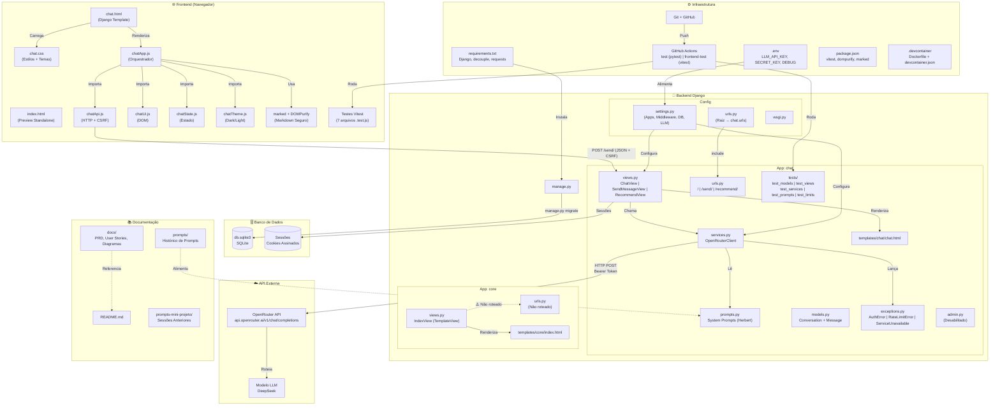

# 💻 Ajuda Tech — Assistente Inteligente para Compra de Computadores


> Ajuda Tech é uma aplicação web com IA integrada que ajuda usuários leigos a encontrarem o computador ideal de acordo com sua necessidade e orçamento, sem exigir conhecimento técnico.


---

## 🎯 Sobre o Projeto

Muitas pessoas têm dificuldade em escolher um computador porque não entendem as especificações técnicas. O Ajuda Tech resolve isso com uma conversa simples: o usuário descreve o que quer fazer com o computador e a IA recomenda a melhor opção.

### Funcionalidades

- Chat interativo com IA para coleta de necessidades do usuário
- Recomendação personalizada de PC ou Notebook com base no perfil do usuário
- Explicações em linguagem simples, sem jargões técnicos
- Histórico de conversas por sessão
- Interface web responsiva e acessível
- Preview isolado do frontend sem depender do Django
- Suporte a tema claro/escuro e renderização segura de Markdown no chat

## 📦 Pré-requisitos

- Python 3.12 ou superior — verifique com `python --version`
- pip — recomendado usar `python -m pip --version`
- Node.js e npm para testes e preview do frontend — verifique com `node --version` e `npm --version`
- Chave de API do provedor de LLM para executar a integração com IA, obtida em [OpenRouter](https://openrouter.ai)
- Docker e VS Code Dev Containers, se quiser rodar o projeto no ambiente containerizado de desenvolvimento

---

## 🚀 Instalação

### Ambiente local

#### Clone o repositório

```bash
git clone https://github.com/SCTECH-ATIVIDADES/ajuda.tech.git
cd ajuda.tech
```

#### Crie e ative o ambiente virtual

```bash
python -m venv venv
source venv/bin/activate
```

No Windows:

```bash
venv\Scripts\activate
```

#### Instale as dependências do backend

```bash
python -m pip install -r requirements.txt
```

#### Crie o arquivo de ambiente

```bash
cp .env.example .env
```

Depois, edite o arquivo `.env` com os valores do seu ambiente.

#### Aplique as migrações

```bash
python manage.py migrate
```

#### Inicie o servidor de desenvolvimento

```bash
python manage.py runserver
```

Acesse em: `http://localhost:8000`

### Dev Container com Docker

O projeto inclui configuração de desenvolvimento em container por meio de [.devcontainer/devcontainer.json](.devcontainer/devcontainer.json) e [.devcontainer/Dockerfile](.devcontainer/Dockerfile).

#### Requisitos para usar o Dev Container

- Docker em execução na máquina
- VS Code com a extensão Dev Containers

#### Como abrir o projeto no container

1. Clone o repositório.
2. Abra a pasta `ajuda.tech` no VS Code.
3. Execute o comando `Dev Containers: Reopen in Container`.
4. Aguarde o `postCreateCommand` instalar automaticamente as dependências Python e Node.
5. Inicie a aplicação com `python manage.py runserver`.

### Frontend do chat (preview local, sem Django)

```bash
npm install
npm test
npx serve chat/static/chat
```

Abra a URL exibida (ex.: `http://localhost:3000`) para ver a página de chat com API mockada.

---

## ⚙️ Variáveis de Ambiente

```env
SECRET_KEY=sua_chave_secreta_django
DEBUG=True
ALLOWED_HOSTS=localhost,127.0.0.1
LLM_API_KEY=sua_chave_de_api_da_ia
LLM_PROVIDER=openai
LLM_MODEL=deepseek/deepseek-v4-flash:free
LLM_TIMEOUT=30
SITE_URL=http://localhost:8000
SITE_NAME=Ajuda Tech
LOG_LEVEL=INFO
```

O repositório não deve receber chaves reais. Use o `.env.example` como base e ajuste os valores conforme seu ambiente.

O token usado em `LLM_API_KEY` deve ser gerado na sua conta em [OpenRouter](https://openrouter.ai).

---

## 🧪 Testes

### Backend

```bash
pytest
```

### Frontend

```bash
npm test
```

### Modo watch para os testes JS

```bash
npm run test:watch
```

Os testes JavaScript usam Vitest com ambiente `jsdom`, e os testes Python usam `pytest` com configuração definida em `pytest.ini`.

---

## 🌐 Endpoints Principais

| Método | Rota | Descrição |
| --- | --- | --- |
| GET | / | Renderiza o chat e inicia uma nova sessão |
| POST | /send/ | Recebe a mensagem do usuário e retorna a resposta da IA |
| POST | /recommend/ | Retorna uma recomendação estruturada com produtos |

---

## 📁 Estrutura do Projeto

### Visão simplificada

```shell
ajuda.tech/
├── .devcontainer/
├── ajuda_tech/
├── chat/
│   ├── static/chat/
│   │   ├── css/
│   │   └── js/
│   ├── templates/chat/
│   ├── tests/
│   ├── prompts.py
│   ├── services.py
│   ├── urls.py
│   └── views.py
├── core/
├── docs/
├── logs/
├── manage.py
├── package.json
├── pytest.ini
├── requirements.txt
└── README.md
```

### Diagrama do Ecossistema

O diagrama abaixo representa a arquitetura completa do Ajuda Tech, incluindo frontend, backend, banco de dados, integração com API externa, infraestrutura e documentação:



---

## 🧭 Desenvolvimento

- O backend expõe as rotas principais em `chat/urls.py`.
- O frontend do chat fica em `chat/static/chat/` com JavaScript modular.
- O projeto usa sessões em cookies assinados para manter o estado da conversa.
- Os logs são gravados em `logs/app.log` e `logs/errors.log` com rotação de arquivos.

---

## 🤝 Contribuindo

1. Faça um fork do projeto
2. Crie uma branch para sua feature (`git checkout -b feature/nova-feature`)
3. Commit suas alterações (`git commit -m 'feat: adiciona nova feature'`)
4. Push para a branch (`git push origin feature/nova-feature`)
5. Abra um Pull Request

---

## 📄 Licença

Este projeto está sob a licença MIT. Veja o arquivo `LICENSE` para mais detalhes.
