# 💻 Ajuda Tech — Assistente Inteligente para Compra de Computadores

Ajuda Tech é uma aplicação web com IA integrada que auxilia usuários leigos a encontrarem o computador ideal (PC ou Notebook) de acordo com sua necessidade e orçamento — sem precisar entender de tecnologia.


---

## 🎯 Objetivo

Muitas pessoas têm dificuldade em escolher um computador porque não entendem as especificações técnicas. O Ajuda Tech resolve isso com uma conversa simples: o usuário descreve o que quer fazer com o computador e a IA recomenda a melhor opção.

---

## 🚀 Funcionalidades

- Chat interativo com IA para coleta de necessidades do usuário
- Recomendação personalizada de PC ou Notebook com base no perfil do usuário
- Explicações em linguagem simples, sem jargões técnicos
- Histórico de conversas por sessão
- Interface web responsiva e acessível

---

## 🛠️ Tecnologias (MVP)

| Camada         | Tecnologia                   |
| -------------- | ---------------------------- |
| Backend        | Python 3.12+                 |
| Framework      | Django 5.x                   |
| IA             | API de LLM (Open Router) |
| Frontend       | Django Templates + HTML/CSS  |

---

## 📦 Instalação e Configuração

### Pré-requisitos

- Python 3.12 ou superior
- pip (recomendado usar python -m pip)
- Chave de API do provedor de LLM (Open Router)

### Passos

```bash
# 1. Clone o repositório
git clone https://github.com/seu-usuario/Ajuda Tech.git
cd ajudatech

# 2. Crie e ative o ambiente virtual
python -m venv venv
source venv/bin/activate  # Linux/macOS
venv\Scripts\activate   # Windows

# 3. Instale as dependências
# Recomendação: utilize o gerenciador de pacotes pip via python -m pip
python -m pip install -r requirements.txt

# 4. Configure as variáveis de ambiente
# Edite o arquivo .env (já incluso no repositório) e preencha conforme seu ambiente.

# 5. Aplique as migrações
python manage.py migrate

# 6. Execute testes (opcional)
pytest

# 7. Inicie o servidor de desenvolvimento
python manage.py runserver
```

Acesse em: `http://localhost:8000`

### Front-end do chat (preview local, sem Django)

```bash
npm install
npm test
npx serve chat/static/chat
```

Abra a URL exibida (ex.: `http://localhost:3000`) para ver a página de chat com API mockada.

---

## ⚙️ Variáveis de Ambiente

```env
SECRET_KEY=sua_chave_secreta_django
DEBUG=True
ALLOWED_HOSTS=localhost,127.0.0.1
LLM_API_KEY=sua_chave_de_api_da_ia
LLM_PROVIDER=openrouter  # ou openrouter
```

Observação: o projeto inclui um arquivo `.env` com valores de exemplo; não comite chaves reais. Para variáveis sensíveis em desenvolvimento, prefira usar um arquivo `.env.local` (listado no .gitignore) e rotacione chaves caso ocorram exposições.

---

## 📁 Estrutura do Projeto — Diagrama do Ecossistema

O diagrama abaixo representa a arquitetura completa do Ajuda Tech, incluindo frontend, backend, banco de dados, integração com API externa, infraestrutura e documentação:

```mermaid
graph TB
    subgraph "🌐 Frontend (Navegador)"
        CHAT_HTML["chat.html<br/>(Django Template)"]
        INDEX_HTML["index.html<br/>(Preview Standalone)"]
        CSS["chat.css<br/>(Estilos + Temas)"]
        JS_APP["chatApp.js<br/>(Orquestrador)"]
        JS_API["chatApi.js<br/>(HTTP + CSRF)"]
        JS_UI["chatUi.js<br/>(DOM)"]
        JS_STATE["chatState.js<br/>(Estado)"]
        JS_THEME["chatTheme.js<br/>(Dark/Light)"]
        LIBS["marked + DOMPurify<br/>(Markdown Seguro)"]
        TESTS_JS["Testes Vitest<br/>(7 arquivos .test.js)"]
    end

    subgraph "🐍 Backend Django"
        subgraph "Config"
            SETTINGS["settings.py<br/>(Apps, Middleware, DB, LLM)"]
            ROOT_URLS["urls.py<br/>(Raiz → chat.urls)"]
            WSGI["wsgi.py"]
        end
        subgraph "App: chat"
            VIEWS["views.py<br/>ChatView | SendMessageView | RecommendView"]
            URLS_CHAT["urls.py<br/>/ | /send/ | /recommend/"]
            SERVICES["services.py<br/>OpenRouterClient"]
            PROMPTS["prompts.py<br/>System Prompts (Herbert)"]
            MODELS["models.py<br/>Conversation + Message"]
            EXCEPTIONS["exceptions.py<br/>AuthError | RateLimitError | ServiceUnavailable"]
            ADMIN["admin.py<br/>(Desabilitado)"]
            TEMPLATES["templates/chat/chat.html"]
            TESTS_PY["tests/<br/>test_models | test_views<br/>test_services | test_prompts | test_limits"]
        end
        subgraph "App: core"
            CORE_VIEWS["views.py<br/>IndexView (TemplateView)"]
            CORE_URLS["urls.py<br/>(Não roteado)"]
            CORE_TEMPLATE["templates/core/index.html"]
        end
        DJANGO_MGMT["manage.py"]
    end

    subgraph "🗄️ Banco de Dados"
        SQLITE[("db.sqlite3<br/>SQLite")]
        SESSION_DB[("Sessões<br/>Database-backed")]
    end

    subgraph "☁️ API Externa"
        OPENROUTER["OpenRouter API<br/>api.openrouter.ai/v1/chat/completions"]
        LLM_MODEL["Modelo LLM<br/>Nemotron / DeepSeek"]
    end

    subgraph "⚙️ Infraestrutura"
        GIT["Git + GitHub"]
        CI_CD["GitHub Actions<br/>test (pytest) | frontend-test (vitest)"]
        ENV[".env<br/>LLM_API_KEY, SECRET_KEY, DEBUG"]
        REQS["requirements.txt<br/>Django, decouple, requests"]
        PACKAGE["package.json<br/>vitest, dompurify, marked"]
    end

    subgraph "📚 Documentação"
        README["README.md"]
        DOCS["docs/<br/>PRD, User Stories, Diagramas"]
        PROMPTS_DOC["prompts/<br/>Histórico de Prompts"]
        PROMPTS_MINI["prompts-mini-projeto/<br/>Sessões Anteriores"]
    end

    %% Conexões Frontend → Backend
    CHAT_HTML -->|"Renderiza"| JS_APP
    JS_APP -->|"Importa"| JS_API
    JS_APP -->|"Importa"| JS_UI
    JS_APP -->|"Importa"| JS_STATE
    JS_APP -->|"Importa"| JS_THEME
    JS_APP -->|"Usa"| LIBS
    CHAT_HTML -->|"Carrega"| CSS

    JS_API -->|"POST /send/ (JSON + CSRF)"| VIEWS

    %% Conexões Backend interno
    ROOT_URLS -->|"include"| URLS_CHAT
    VIEWS -->|"Lê/Escreve"| MODELS
    VIEWS -->|"Chama"| SERVICES
    SERVICES -->|"Lê"| PROMPTS
    SERVICES -->|"Lança"| EXCEPTIONS
    VIEWS -->|"Renderiza"| TEMPLATES
    SETTINGS -->|"Configura"| VIEWS
    SETTINGS -->|"Configura"| SERVICES
    SETTINGS -->|"Configura"| MODELS

    %% Core (não usado)
    CORE_VIEWS -.->|"⚠️ Não roteado"| CORE_URLS
    CORE_VIEWS -->|"Renderiza"| CORE_TEMPLATE

    %% Banco de Dados
    MODELS -->|"CRUD"| SQLITE
    VIEWS -->|"Sessões"| SESSION_DB
    DJANGO_MGMT -->|"manage.py migrate"| SQLITE

    %% API Externa
    SERVICES -->|"HTTP POST<br/>Bearer Token"| OPENROUTER
    OPENROUTER -->|"Roteia"| LLM_MODEL

    %% Infraestrutura
    GIT -->|"Push"| CI_CD
    CI_CD -->|"Roda"| TESTS_PY
    CI_CD -->|"Roda"| TESTS_JS
    ENV -->|"Alimenta"| SETTINGS
    REQS -->|"Instala"| DJANGO_MGMT

    %% Documentação
    DOCS -.->|"Referencia"| README
    PROMPTS_DOC -.->|"Alimenta"| PROMPTS
```



---

## 🤝 Contribuindo

1. Faça um fork do projeto
2. Crie uma branch para sua feature (`git checkout -b feature/nova-feature`)
3. Commit suas alterações (`git commit -m 'feat: adiciona nova feature'`)
4. Push para a branch (`git push origin feature/nova-feature`)
5. Abra um Pull Request

---

## 📄 Licença

Este projeto está sob a licença MIT. Veja o arquivo `LICENSE` para mais detalhes.
