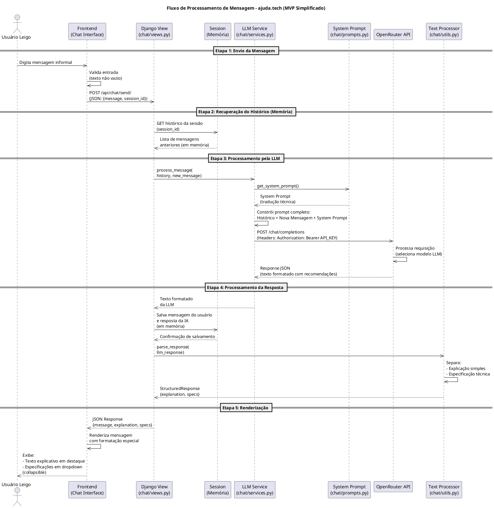

# Diagrama de Sequência - Fluxo de Processamento de Mensagem

**Simplificação do MVP:** Sem banco de dados, sem login.

## Código PlantUML

## Como Visualizar o Diagrama

Com a extensão **PlantUML** instalada no seu editor (VS Code, IntelliJ, etc.), você tem as seguintes opções:

### Opção 1: Visualização Direta no Editor
1. Abra o arquivo `DIAGRAMA_SEQUENCIA.md` no seu editor
2. O diagrama será renderizado automaticamente se a extensão PlantUML estiver ativa
3. Caso não renderize automaticamente, clique com o botão direito no código PlantUML e selecione **"Preview PlantUML"** ou **"Open Preview to the Side"**

### Opção 2: Atalhos do VS Code
- **Windows/Linux**: `Ctrl + Shift + P` → Digite "PlantUML" → Selecione "Preview Current Diagram"
- **Mac**: `Cmd + Shift + P` → Mesmo processo

### Opção 3: Exportar como Imagem
1. Com a extensão PlantUML instalada, você também pode:
   - Clicar com botão direito no diagrama
   - Selecionar **"Export Current Diagram"**
   - Escolher o formato (PNG, SVG, etc.)

### Dependências da Extensão
A extensão PlantUML geralmente requer:
- **Java** instalado (para executar o servidor PlantUML local)
- **Graphviz** (instalado separadamente para renderização)

Se o diagrama não aparecer, verifique se essas dependências estão instaladas corretamente.

## Descrição do Fluxo (MVP Simplificado)

| Etapa | Ator/Componente | Descrição |
|-------|-----------------|-----------|
| 1 | Usuário Leigo | Usuário digita mensagem informal no frontend |
| 2 | Frontend | Interface valida e envia via AJAX para Django |
| 3 | Session (Memória) | Recupera histórico da conversa (sem banco de dados) |
| 4 | LLM Service | Combina contexto + System Prompt para enviar à API |
| 5 | OpenRouter | Gateway que gerencia múltiplos modelos de LLM |
| 6 | Text Processor | Parser que separa explicação amigável de specs técnicas |
| 7 | Frontend | Renderiza com destaque para explicação e dropdown para specs |

## Alterações do MVP Simplificado

### Removido
- ~~Banco de Dados PostgreSQL~~
- ~~Transações de banco~~
- ~~Models de usuário~~
- ~~Sistema de autenticação~~
- ~~Migrações de banco~~

### Adicionado
- **Session (Memória)**: Armazenamento temporário do histórico da conversa
- **Cookie de sessão**: Para manter o contexto entre requisições
- **Limite de mensagens**: 50 mensagens por sessão (para evitar abusos)

## Elementos do Diagrama

- **Seta sólida (→)**: Fluxo síncrono de requisição/resposta
- **Seta tracejada (--)**: Retorno de dados ou resposta
- **Caixas empilhadas**: Instâncias paralelas do mesmo componente
- **Notas**: Informações adicionais sobre cada etapa