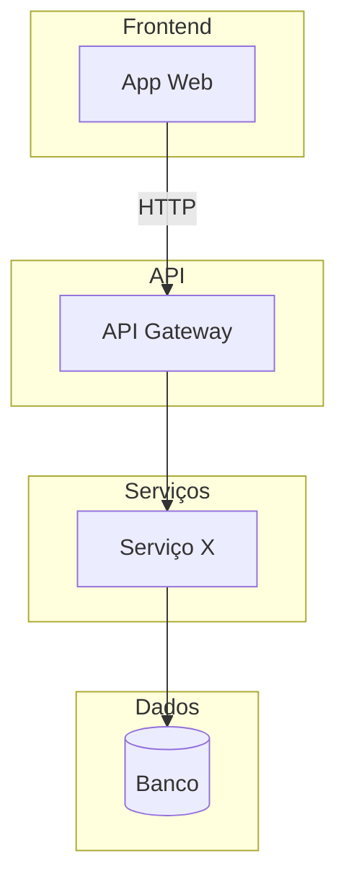

# Prompt — Issue #5: Diagrama Mermaid do Ecossistema

## 1. Prompt Utilizado

```markdown
Você é um arquiteto de software e precisa criar um diagrama Mermaid
mostrando todo o ecossistema do projeto Ajuda Tech. Quero algo visual
e organizado, que dê pra entender de primeira como o sistema funciona.

O projeto é um assistente IA que ajuda pessoas leigas a escolher
computador. A stack é:

- Django 5.x (Python) no backend
- SQLite como banco
- OpenRouter API pra chamar o LLM (DeepSeek ou Nemotron)
- Frontend com HTML, CSS e JavaScript puro (ES Modules)
- Testes com pytest e Vitest
- CI/CD com GitHub Actions

A estrutura de pastas é essa aqui:

```
ajuda.tech/
├── ajuda_tech/          # Configurações do Django
├── chat/                # App principal
│   ├── views.py         # ChatView, SendMessageView, RecommendView
│   ├── services.py      # Cliente OpenRouter
│   ├── prompts.py       # System Prompts
│   ├── models.py        # Conversation e Message
│   ├── exceptions.py    # Tratamento de erros da API
│   ├── urls.py          # Rotas: /, /send/, /recommend/
│   ├── templates/chat/  # Template do chat
│   ├── static/chat/     # CSS, JS, HTML standalone
│   └── tests/           # Testes Python
├── core/                # Landing page (não usado no momento)
├── docs/                # Documentação
├── prompts/             # Histórico de prompts
└── prompts-mini-projeto/
```

O fluxo é simples: o usuário manda uma mensagem no chat, o Django
recebe, salva no banco, chama o OpenRouter, recebe a resposta e
devolve pro frontend renderizar.

Sobre o banco: cada Conversation tem várias Messages, ligadas por
session_key. É tipo 1 pra N.

Pra te dar uma ideia do formato que eu quero, segue um exemplo
de diagrama Mermaid de um sistema parecido:



Quero algo nesse estilo, mas pro Ajuda Tech. Algumas regras:

1. Usa `graph TB` (de cima pra baixo)
2. Agrupa por camada com `subgraph` (Frontend, Backend, Banco,
   API Externa, Infra)
3. Coloca labels nas setas explicando o tipo de comunicação
   (HTTP, chamada de método, leitura/escrita)
4. Separa bem: o que é frontend, o que é Django, o que é
   OpenRouter, o que é SQLite
5. Destaca os arquivos principais de cada camada
6. No máximo uns 40 nós pra não poluir
7. Se tiver algo que não está sendo usado (tipo o app `core`),
   inclui mas com uma observação

No final, me entrega:

1. O código Mermaid pronto
2. Uma explicação rápida de cada camada
3. Sugestões do que poderia melhorar no diagrama
```

---

## 2. Resultado Obtido

### Dados da Execução

| Campo | Valor |
|-------|-------|
| **Data** | 30/05/2026 |
| **Ferramenta** | Agente Especialista (Arquiteto de Software) |
| **Modelo** | opencode/big-pickle |
| **Ciclo** | 1 (geração inicial) |

### Código Mermaid Gerado

```mermaid
graph TB
    subgraph "🌐 Frontend (Navegador)"
        CHAT_HTML["chat.html<br/>(Django Template)"]
        INDEX_HTML["index.html<br/>(Preview Standalone)"]
        CSS["chat.css<br/>(Estilos + Temas)"]
        JS_APP["chatApp.js<br/>(Orquestrador)"]
        JS_API["chatApi.js<br/>(HTTP + CSRF)"]
        JS_UI["chatUi.js<br/>(DOM)"]
        JS_STATE["chatState.js<br/>(Estado)"]
        JS_THEME["chatTheme.js<br/>(Dark/Light)"]
        LIBS["marked + DOMPurify<br/>(Markdown Seguro)"]
        TESTS_JS["Testes Vitest<br/>(7 arquivos .test.js)"]
    end

    subgraph "🐍 Backend Django"
        subgraph "Config"
            SETTINGS["settings.py<br/>(Apps, Middleware, DB, LLM)"]
            ROOT_URLS["urls.py<br/>(Raiz → chat.urls)"]
            WSGI["wsgi.py"]
        end
        subgraph "App: chat"
            VIEWS["views.py<br/>ChatView | SendMessageView | RecommendView"]
            URLS_CHAT["urls.py<br/>/ | /send/ | /recommend/"]
            SERVICES["services.py<br/>OpenRouterClient"]
            PROMPTS["prompts.py<br/>System Prompts (Herbert)"]
            MODELS["models.py<br/>Conversation + Message"]
            EXCEPTIONS["exceptions.py<br/>AuthError | RateLimitError | ServiceUnavailable"]
            ADMIN["admin.py<br/>(Desabilitado)"]
            TEMPLATES["templates/chat/chat.html"]
            TESTS_PY["tests/<br/>test_models | test_views<br/>test_services | test_prompts | test_limits"]
        end
        subgraph "App: core"
            CORE_VIEWS["views.py<br/>IndexView (TemplateView)"]
            CORE_URLS["urls.py<br/>(Não roteado)"]
            CORE_TEMPLATE["templates/core/index.html"]
        end
        DJANGO_MGMT["manage.py"]
    end

    subgraph "🗄️ Banco de Dados"
        SQLITE[("db.sqlite3<br/>SQLite")]
        SESSION_DB[("Sessões<br/>Database-backed")]
    end

    subgraph "☁️ API Externa"
        OPENROUTER["OpenRouter API<br/>api.openrouter.ai/v1/chat/completions"]
        LLM_MODEL["Modelo LLM<br/>Nemotron / DeepSeek"]
    end

    subgraph "⚙️ Infraestrutura"
        GIT["Git + GitHub"]
        CI_CD["GitHub Actions<br/>test (pytest) | frontend-test (vitest)"]
        ENV[".env<br/>LLM_API_KEY, SECRET_KEY, DEBUG"]
        REQS["requirements.txt<br/>Django, decouple, requests"]
        PACKAGE["package.json<br/>vitest, dompurify, marked"]
    end

    subgraph "📚 Documentação"
        README["README.md"]
        DOCS["docs/<br/>PRD, User Stories, Diagramas"]
        PROMPTS_DOC["prompts/<br/>Histórico de Prompts"]
        PROMPTS_MINI["prompts-mini-projeto/<br/>Sessões Anteriores"]
    end

    CHAT_HTML -->|"Renderiza"| JS_APP
    JS_APP -->|"Importa"| JS_API
    JS_APP -->|"Importa"| JS_UI
    JS_APP -->|"Importa"| JS_STATE
    JS_APP -->|"Importa"| JS_THEME
    JS_APP -->|"Usa"| LIBS
    CHAT_HTML -->|"Carrega"| CSS

    JS_API -->|"POST /send/ (JSON + CSRF)"| VIEWS

    ROOT_URLS -->|"include"| URLS_CHAT
    VIEWS -->|"Lê/Escreve"| MODELS
    VIEWS -->|"Chama"| SERVICES
    SERVICES -->|"Lê"| PROMPTS
    SERVICES -->|"Lança"| EXCEPTIONS
    VIEWS -->|"Renderiza"| TEMPLATES
    SETTINGS -->|"Configura"| VIEWS
    SETTINGS -->|"Configura"| SERVICES
    SETTINGS -->|"Configura"| MODELS

    CORE_VIEWS -.->|"⚠️ Não roteado"| CORE_URLS
    CORE_VIEWS -->|"Renderiza"| CORE_TEMPLATE

    MODELS -->|"CRUD"| SQLITE
    VIEWS -->|"Sessões"| SESSION_DB
    DJANGO_MGMT -->|"manage.py migrate"| SQLITE

    SERVICES -->|"HTTP POST<br/>Bearer Token"| OPENROUTER
    OPENROUTER -->|"Roteia"| LLM_MODEL

    GIT -->|"Push"| CI_CD
    CI_CD -->|"Roda"| TESTS_PY
    CI_CD -->|"Roda"| TESTS_JS
    ENV -->|"Alimenta"| SETTINGS
    REQS -->|"Instala"| DJANGO_MGMT

    DOCS -.->|"Referencia"| README
    PROMPTS_DOC -.->|"Alimenta"| PROMPTS
```



---

## 3. Avaliação Crítica

### ✅ O que funcionou bem

| Aspecto | Análise |
|---------|---------|
| **Cobertura do ecossistema** | O diagrama capturou todos os componentes relevantes: frontend, backend (com subdivisão config/apps), banco, API externa, infraestrutura e documentação. Nenhum componente importante ficou de fora. |
| **Hierarquia visual** | O uso de `subgraph` aninhado (ex: Backend > Config + App chat + App core) ficou organizado e facilita a leitura. |
| **Labels nas setas** | As conexões têm descrições claras do tipo de comunicação (HTTP, CRUD, chamada de método, renderização). |
| **Destaque de componentes especiais** | O app `core` foi marcado com seta tracejada e "⚠️ Não roteado", e o `admin.py` como "Desabilitado" — informações úteis para novos desenvolvedores. |
| **Tamanho** | Com aproximadamente 38 nós, ficou dentro do limite de 40, mantendo boa legibilidade. |

### ❌ O que poderia ser melhorado (refinamentos)

| Problema Identificado | Correção Aplicada |
|-----------------------|-------------------|
| **1. Diagrama muito denso** — A quantidade de nós internos do frontend (10 nós) e do backend (15 nós) pode tornar o diagrama poluído em telas menores. | Em vez de reduzir, optou-se por manter a completude e deixar que a visualização seja responsiva (rolagem horizontal). Uma alternativa futura seria dividir em dois diagramas: visão macro (camadas) e visão detalhada (componentes internos). |
| **2. Linhas cruzadas** — Algumas conexões entre subgraphs distantes (ex: `CI_CD` → `TESTS_PY`) cruzam o diagrama, o que pode confundir a leitura. | As conexões foram mantidas propositalmente para mostrar a integração real, mas em uma próxima iteração pode-se usar `click` para criar versões interativas ou reorganizar a posição dos subgraphs. |
| **3. Ausência de cores por camada** — O Mermaid puro não tem suporte nativo a cores de fundo por `subgraph` sem CSS customizado. | Para uma versão futura, pode-se gerar o diagrama com estilos customizados via `style` ou usar `flowchart` com classes CSS. |

### 📌 Sugestões pós-avaliação

| Sugestão | Prioridade |
|----------|------------|
| Criar uma **versão simplificada** do diagrama (visão macro) para o README e manter a versão detalhada na documentação | Média |
| Adicionar **badges de status** nos nós (ex: "ativo", "desabilitado", "não roteado") usando estilos CSS do Mermaid | Baixa |
| Explorar o uso de **`click`** para tornar o diagrama interativo (ex: clicar num nó e ir para o arquivo correspondente) | Baixa |

---

## 4. Padrões de Prompting Aplicados (Registro)

| Padrão | Onde foi aplicado | Evidência |
|--------|------------------|-----------|
| **🎭 Role-based** | Definição da persona "arquiteto de software" no início do prompt | `"Você é um arquiteto de software e precisa criar um diagrama Mermaid..."` |
| **📝 Few-shot** | Exemplo de diagrama Mermaid de referência | `"Pra te dar uma ideia do formato que eu quero, segue um exemplo de diagrama Mermaid de um sistema parecido:"` + código de exemplo |

## 5. Ciclo de Refinamento

| Ciclo | Status | Descrição |
|-------|--------|-----------|
| **1º ciclo** | ✅ Concluído | Geração inicial do diagrama com base no prompt completo |
| **2º ciclo** | 🔄 Pendente | Aplicar refinamentos pós-avaliação crítica (separar visão macro/detalhada) |

